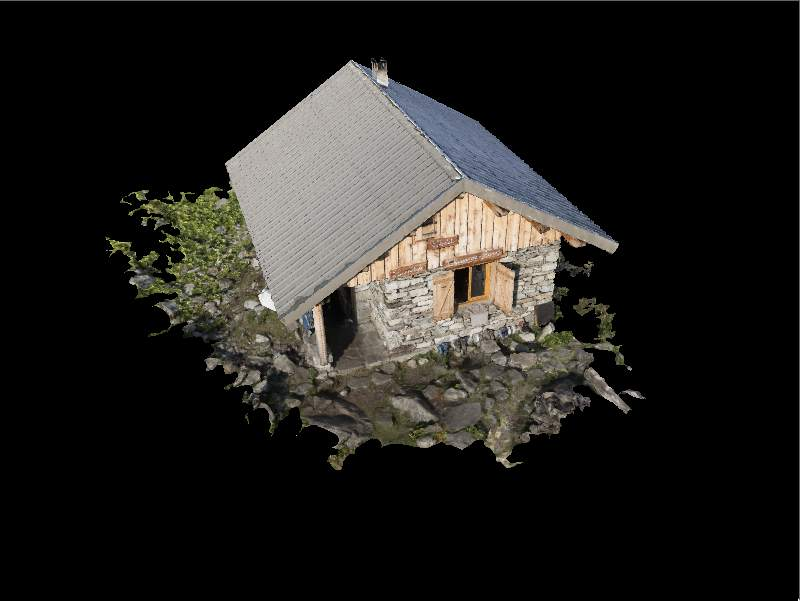
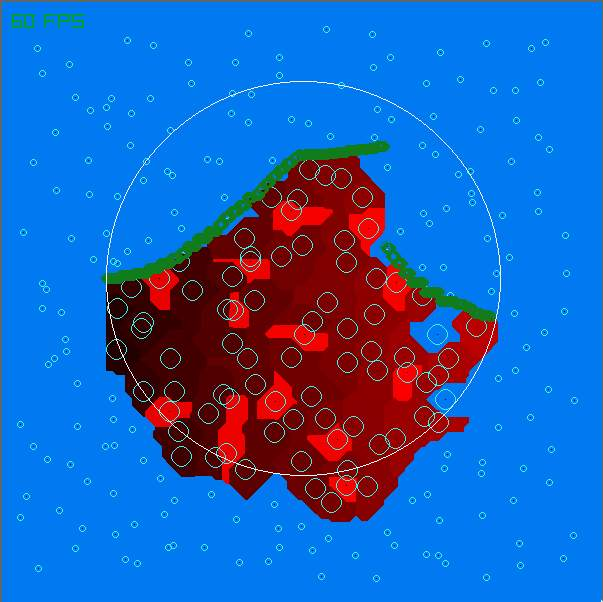
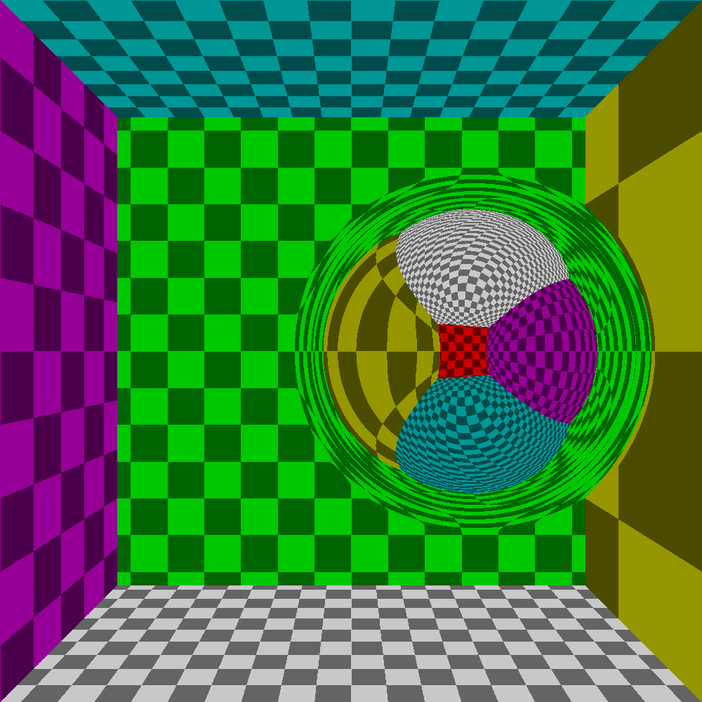
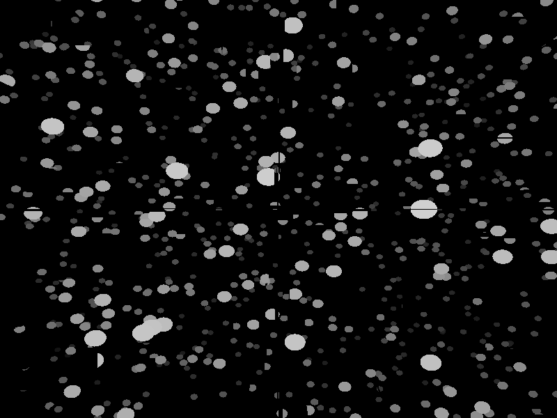
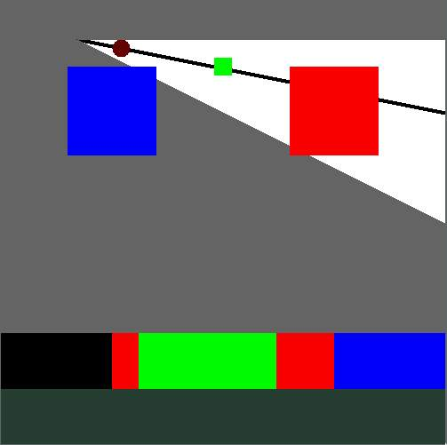
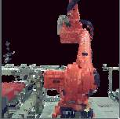

# lagerhalle
Stuff I don't want to delete

| Folders | Image | Description |
|:-------:|:-----:|-------------|
|[C_VulkanTutorial](C_VulkanTutorial) | |[Vulkan-Tutorial.com](https://vulkan-tutorial.com) in pure C|
|[Odin_FloatingIslands](Odin_FloatingIslands) |  | 2D floating island generation based on a height-line and voronoi ground |
|[Odin_RayGravity](Odin_RayGravity) |  | simple ray-singularity-interaction, currently only rotating the ray direction around the center depending on the dinstance of the nearest point on the ray. Nothing fancy, but still pretty |
|[Odin_RAytracing](Odin_RAytracing) |  | testing an idea about accellerating ray-particle-intersection by sorting the particles in x, y and z respectively |
|[Odin_Script](Odin_Script) | - | Trying out writing an interpreter |
|[Odin_SparceVoxelOctree](Odin_SparceVoxelOctree) |  | Novel idea on ray-voxel-intersection by looking at the angle between the two. Couldn't find any comparable approaches, probably because it is ~~stupid~~ not as good as I originally thought |
|[Odin_swizzle](Odin_swizzle) | - | rgba and xyzw swizzle library written just for fun. Odin now has built in swizzle procedures. |
|[Odin_VulkanTutorial](Odin_VulkanTutorial) | - | [Vulkan-Tutorial.com](https://vulkan-tutorial.com) in pure Odin. Don't know how far I got |

